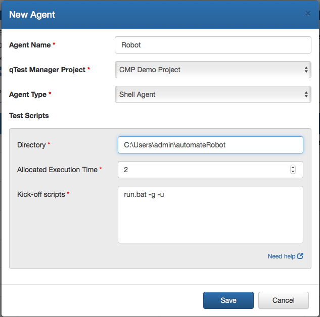
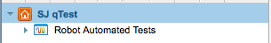
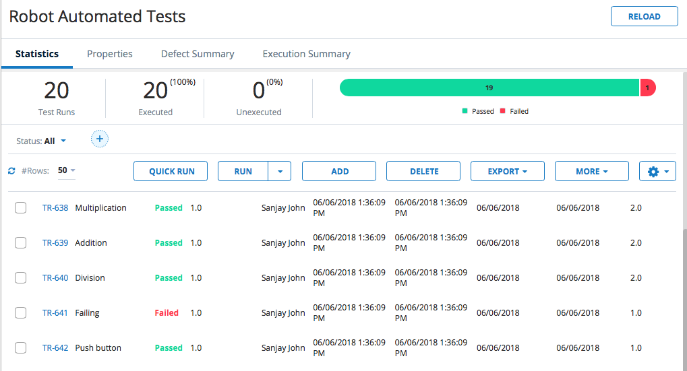
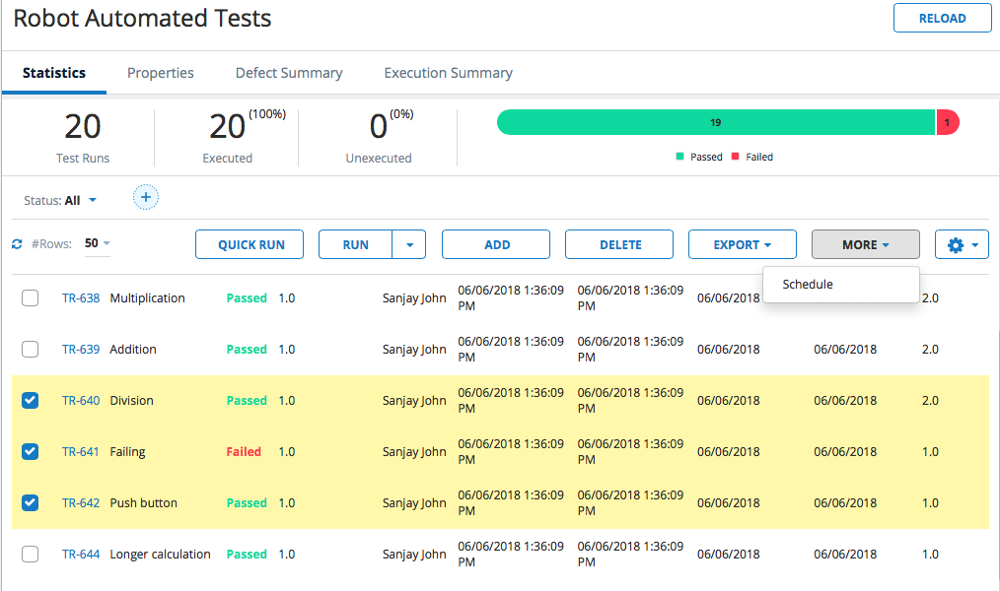

# Robot Framework Automation

## Overview:

This example illustrates how to use the Shell Script Automation Host Feature to pull tests from GitHub, run Robot tests, parse the results, and automatically upload the test results to qTest Manager. After the initial upload, the script allows the user to schedule certain tests from qTest Manager, rerun selected tests, and update only those results on qTest.

## Set up Computer:

1) Install Python 3.6 from [https://www.python.org/downloads/](https://www.python.org/downloads/)

2) Install Git for the Command Line from [https://git-scm.com/download/](https://git-scm.com/download/)

3) Install Robot Framework from [https://pypi.org/project/robotframework/](https://pypi.org/project/robotframework/)

### Tips for Set Up:

Windows:

Before running the automation host script ensure that all environmental variables are set up correctly, specifically that the PATH variable has been updated for Python, Robot, and Git

Mac:

Use Homebrew to install Python and Robot. Steps for installing Homebrew can be found at [https://brew.sh](https://brew.sh)

After installing Homebrew run this following command to get Python3:

`brew install python3`

Enter the following command to get Robot Framework

`brew install robot-framework`

**From Terminal (Mac) or Command Prompt (Windows):**

1. Make sure pip was installed correctly with python on your machine by running the following command. It should output the pip version:

 `pip --version`

 Note: pip3 will work as well. Try `pip3 --version`

2. If pip is not installed, run the following command to install pip:

 `python -m -ensurepip --default-pip`

More information about downloading pip can be found at [https://packaging.python.org/tutorials/installing-packages/](https://packaging.python.org/tutorials/installing-packages/)

3. After you have ensured pip is installed, run the following commands individually:

`pip install requests`

`pip install beautifulsoup4`

`pip install lxml`

Note: If using pip3 run commands with pip3 instead e.g. `pip3 install requests`

These commands will install the necessary modules required to run the python scripts. The modules are used to send requests to the API, and parse xml documents.

## Update Configuration File:

**git\_url:** The shell script uses the url to clone a repository and send pull requests on use

**local\_repository:** The folder containing the test cases. The shell script will use this to know where to run the maven build. Make sure to place this folder in the same directory as the the python and shell scripts.

**qtest\_api\_token:** The token used to authorize the connection to qTest Manager

**qtest\_url:** The personal url that is used to access QASymphony API

Open the conf.json file and update with your personal information. Enter your own qTest URL and API Token found in the qTest Manager Environment.

For this example we will be pulling robot tests from BitBucket, which has a robot demo located at [https://bitbucket.org/robotframework/robotdemo/src/master/](https://bitbucket.org/robotframework/robotdemo/src/master/). For the git url and local repository use the information shown below in the example configuration file. Make sure to use your own api token and url or the demo will not work.

 

## Set Up Automation:

1. Navigate to your Automation Host

 

2.    Add a new agent and fill out the path directory and enter the script into the kick off script field

 
**Agent Name:** Name

**qTest Manager Project:** Choose your project

**Agent Type:** Choose Shell Agent

**Directory:** The directory containing your scripts and shell agent (Directory where the scripts were cloned)

**Set Allocated Execution Time:** Amount of time you expect the script to take to execute in minutes

**Kick-off scripts:** The file path to your shell script. This shell scripts takes in two inputs, one for using git and the second for updating your current test cycle.

### Shell Script Inputs:

**-g**    Uses GitHub to clone a test case repository and send pull requests every time shell script is run

**-u** Updates an existing test cycle or create a new test cycle if first test run

**-b <"branch name">** If the Github parameter is used, this input allows the user to clone the repository and make a branch that they specify with the input. An example of using -b is shown in automateJunit

To run the shell agent without using GitHub or without updating the existing test cycle do not include this parameters in the kick off scripts section. An example of not using -g is used in the JMeter Automation example.

In this example we will be pulling tests from GitHub and updating our test cycle, so the arguments are included and shown below.

## For Mac Users (Use run.sh):

Note for Mac Users: Make sure the shell script is executable by running the command shown below in the shell scripts directory:

`chmod +x run.sh`

This command gives the shell script permission to run.

## For Windows Users (Use run.bat):

## Running Shell Script:

Start the shell script by pressing yellow button under the action text field, which will upload all of the tests cases to qTest

 

## Scheduling Tests:

1.  Login into qTest Manager, go to the Test Execution tab, and there should be a test cycle under your project called &quot;Robot Automated Tests&quot;

 

2. Click on the test cycle and it should show all of the tests that were run through the maven build and their statuses.

 

3. To schedule specific tests check the ones that you want to schedule and click on schedule under the &quot;More&quot; drop down menu.

 

4. Select the shell agent from under the drop down menu for agent, and click ok

 

5. Now that the tests have been scheduled to start them go back to the Automation Host and click Poll Now.

The shell script will only run the scheduled tests and upload those results to qTest Manager