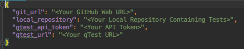
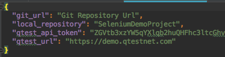
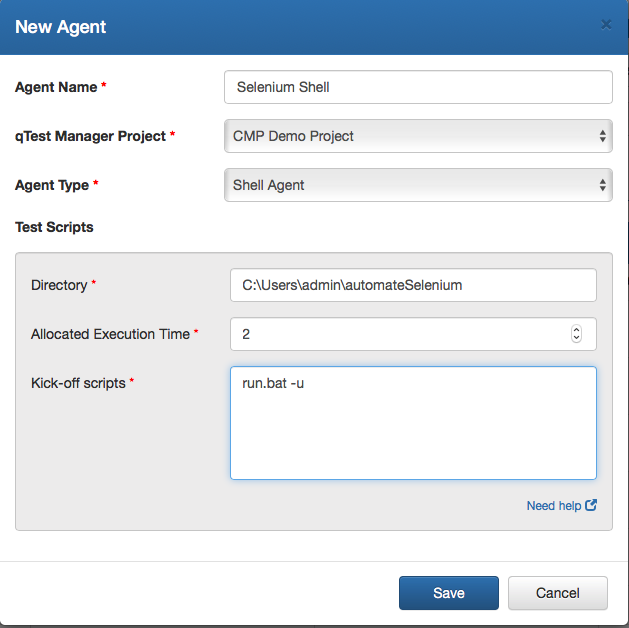
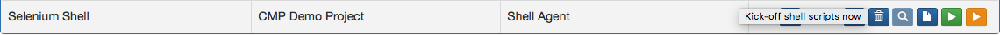
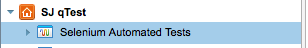
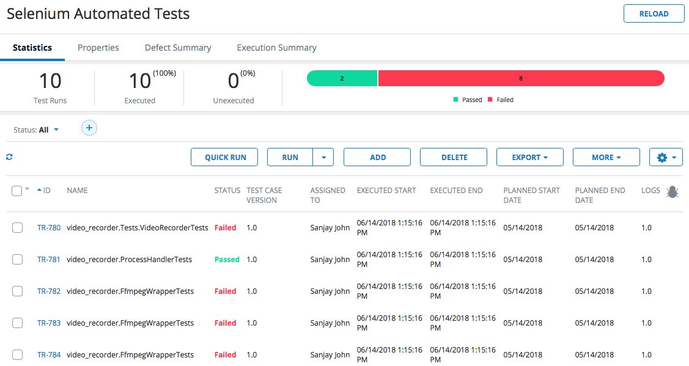
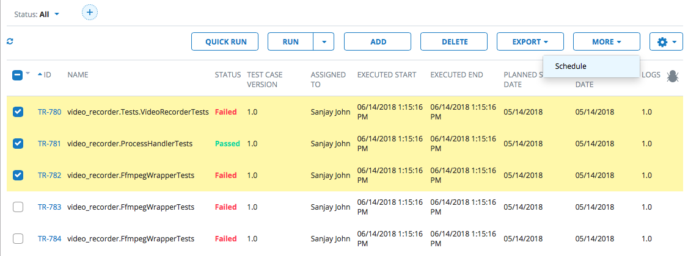
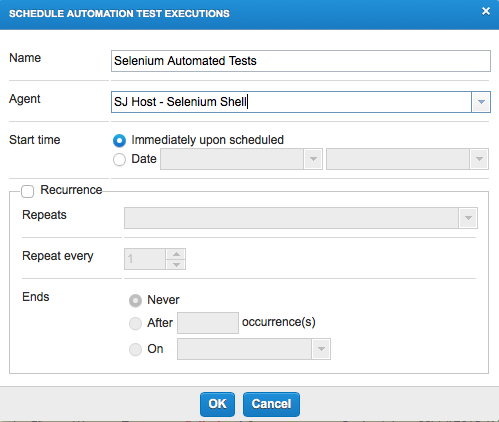
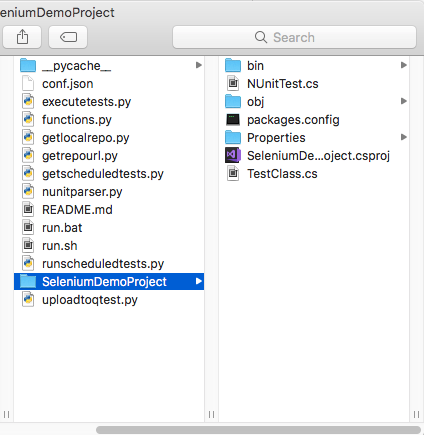

# Selenium Automation

## Overview:

This example illustrates how to use the Shell Script Automation Host Feature to build a .csproj with msbuild, run nunit tests with nunit3-console runner and automatically upload the test results to qTest Manager. After the initial upload, the script allows the user to schedule certain tests from qTest Manager, rerun tests, and update only those results on qTest. Currently, this example illustrates how to run the script on Windows, but a .sh file is included for Mac users to configure.

## Set up Computer:

1) Install Python 3.6 from [https://www.python.org/downloads/](https://www.python.org/downloads/)

2) Install Build Tools for Visual Studio from [https://www.visualstudio.com/downloads/](https://www.visualstudio.com/downloads/)

3) Install Git for the Command Line from [https://git-scm.com/download/](https://git-scm.com/download/)

4) Install Nunit Console from [https://github.com/nunit/nunit-console/releases/](https://github.com/nunit/nunit-console/releases/)

5) Install Firefox from [https://www.mozilla.org/en-US/firefox/new/](https://www.mozilla.org/en-US/firefox/new/)

### Tips for Set Up:

Windows:

Before running the automation host script ensure that all environmental variables are set up correctly, specifically that the PATH variable has been updated for Python, nunit3-console, and MSBuild

### From Command Prompt:

1. Make sure pip was installed correctly with python on your machine by running the following command. It should output the pip version:

 `pip --version`

 Note: pip3 will work as well. Try `pip3 --version`

2. If pip is not installed, run the following command to install pip:

 `python -m -ensurepip --default-pip`

More information about downloading pip can be found at [https://packaging.python.org/tutorials/installing-packages/](https://packaging.python.org/tutorials/installing-packages/)

3. After you have ensured pip is installed, run the following commands individually :

`pip install requests`

`pip install beautifulsoup4`

`pip install lxml`

`pip install pybase64`

Note: If using pip3 run commands with pip3 instead e.g. `pip3 install requests`

These commands will install the necessary modules required to run the python scripts. The modules are used to send requests to the API, read json configuration files, parse xml documents, and upload files to qTest.

## Update Configuration File:

**git\_url:** The shell script uses the url to clone a repository and send pull requests everytime it runs if -g input is used

**local\_repository:** The folder containing the Selenium C Sharp. The shell script will use this to know where to run the nunit tests. To run the nunit tests, the shell script looks for .dll file which is located in bin\Debug. For the script to work the local repository folder name must be the same as the .dll file that gets created when the project gets built.

**qtest\_api\_token:** The token used to authorize the connection to qTest Manager

**qtest\_url:** The personal url that is used to access QASymphony API

Open the conf.json file and update with your personal information. Enter your own qTest URL and API Token found in the qTest Manager Environment.

For this example, we will not be using a GitHub sample instead the Selenium C Sharp project will already be located in repository, as documented in the conf.json sample file below. For the git url you do not have to modify it, and for local repository use the information shown below. Make sure to use your own api token and url or the demo will not work.

 

## Set Up Automation:

1. Navigate to your Automation Host

 

2.    Add a new agent and fill out the path directory and enter the script into the kick off script field

**Agent Name:** Name

**qTest Manager Project:** Choose your project

**Agent Type:** Choose Shell Agent

**Directory:** The directory containing your scripts and shell agent (Directory where the scripts were cloned)

**Set Allocated Execution Time:** Amount of time you expect the script to take to execute in minutes

**Kick-off scripts:** The file path to your shell script. This shell scripts takes in two inputs, one for using git and the second for updating your current test cycle.

### Shell Script Inputs:

**-g**    Uses GitHub to clone a test case repository and send pull requests every time shell script is run

**-u** Updates an existing test cycle or create a new test cycle if first test run

**-b <"branch name">** If the Github parameter is used, this input allows the user to clone the repository and make a branch that they specify with the input. An example of using -b is shown in automateJunit

To run the shell agent without using GitHub or without updating the existing test cycle do not include this parameters in the kick off scripts section.

In this example we will only be updating our test cycle since the local repository folder is already in our directory, so the single argument is included and shown below.

## Configuring  (Windows):

 

## Running Shell Script:

Start the shell script by pressing yellow button under the action text field, which will upload all of the tests cases to qTest

 

## Scheduling Tests:

1.  Login into qTest Manager, go to the Test Execution tab, and there should be a test cycle under your project called &quot;Selenium Automated Tests&quot;

  

2. Click on the test cycle and it should show all of the tests that were run through the Selenium build and their statuses.

3. To schedule specific tests check the ones that you want to schedule and click on schedule under the &quot;More&quot; drop down menu.

 

4. Select the shell agent from under the drop down menu for agent, and click ok

 

5. Now that the tests have been scheduled to start them go back to the Automation Host and click Poll Now.

 

The shell script will only run the scheduled tests and upload those results to qTest Manager

## Note:

The Nunit parser reads from TestResult.xml file, which is located in the bin/Debug directory. Ensure that the .dll file is located in this directory before running the shell script. In addition, make sure the name of the directory where the project is located is the same name as the .csproj being built. In the example shown below, "SeleniumDemoProject" in the name of the local directory, and it is the same name as the .csproj called "SeleniumDemoProject.csproj"

