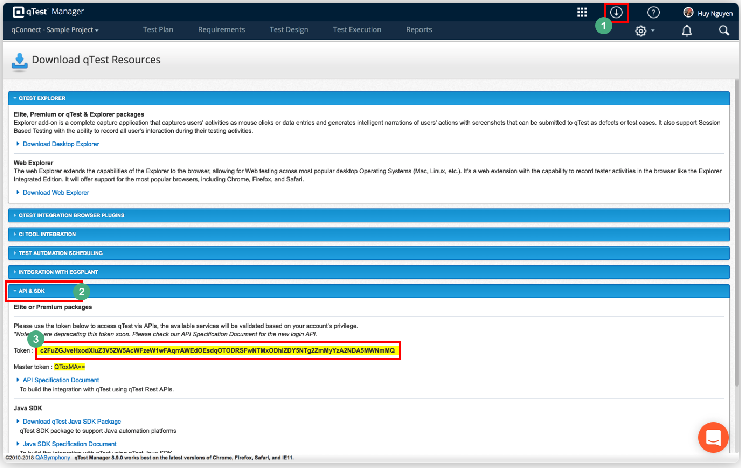
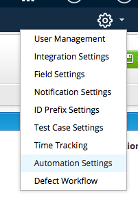

# Overview:

This guide is intended to serve as a tutorial to use the qTest Automation Host feature to run and upload tests to qTest Manager with the Shell Agent and triggering jobs from Jenkins. The Shell Agent allows the user to run and upload all tests to qTest or schedule certain tests from qTest Manager that will upload individually. The shell script agent allows for user based customization as shown in the examples below.

## Install qTest Automation Host:

The Automation Installation Guide can be found here: [https://support.qasymphony.com/hc/en-us/articles/115005561826-qTest-Automation-Host-User-Guide](https://support.qasymphony.com/hc/en-us/articles/115005561826-qTest-Automation-Host-User-Guide)

## Set up qTest Manager Environment:

1.    Acquire your qTest Manager base URL as shown below

  

2.    Acquire personal API Token which can be found under the resource button at the top right of the browser, under the API &amp; SDK Section.

 

Your qTest URL and personal API Token will be needed for configuration in the following examples.

3.    Turn ON Automation Integration which is under the Gear Icon

## Examples:

- In the triggerJenkins directory, a guide is shown how to implement the python scripts to trigger a Jenkins job from your Automation Host. The jobs can be run with or without choice parameters.

- In the uploadJenkinsResults directory, choose the testing Framework example that you would like to see and follow the guide shown there to learn how to upload Jenkins results to qTest Manager. The console output is included in your uploaded results.

